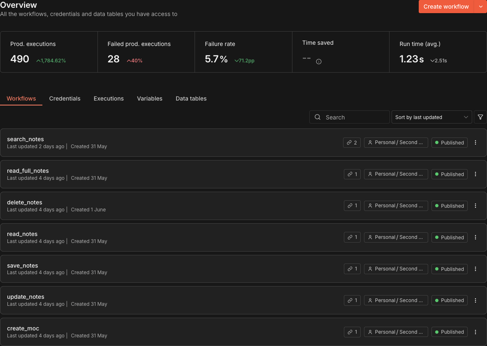
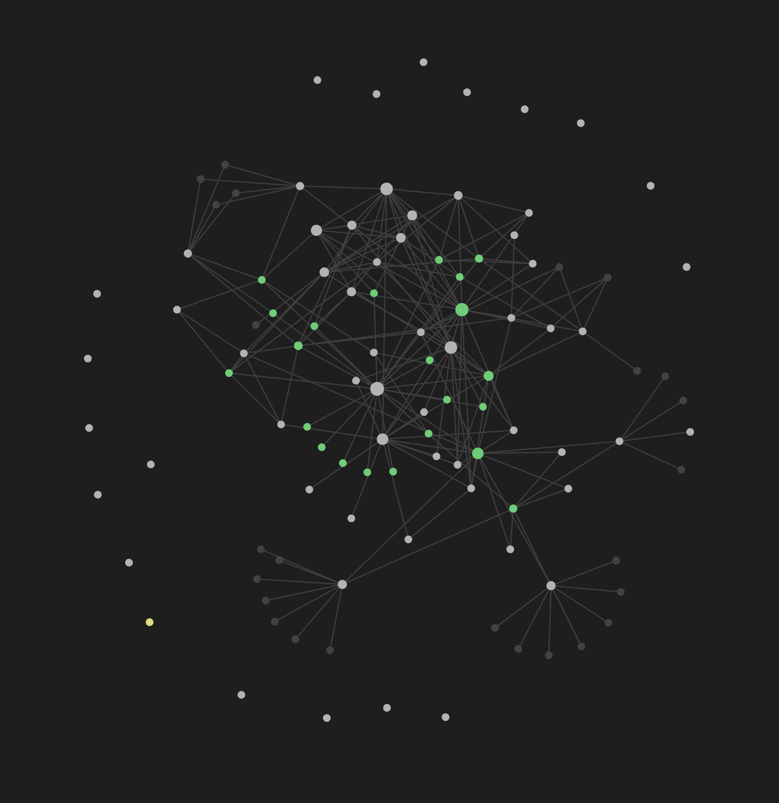

# Second Brain with ChatGPT

Second Brain with ChatGPT is an experimental open-source project for building a personal AI knowledge system with ChatGPT, Codex, Obsidian, n8n, voice control, and local Mac automation.

This repository opens the design behind my personal Second Brain project. It documents how an AI assistant can help capture ideas, search notes, organize knowledge, trigger workflows, and work with a local environment while keeping safety, approval, and user control at the center.

The project started as a personal system. The goal of open-sourcing it is to share the architecture, prompts, workflow patterns, command schema, and security model so other people can adapt the ideas for their own knowledge base and automation setup.

If this project is selected for the ChatGPT Open Source (OSS) program, I will begin fully opening it to the public and continue the research.

## Current personal setup

**Architecture**


**n8n workflows**



**Obsidian vault**



## What this project explores

This project treats ChatGPT as more than a question-answering interface. It explores ChatGPT and Codex as part of a personal operating layer that can:

* Capture thoughts, tasks, and research into a Second Brain
* Search and summarize an Obsidian knowledge base
* Convert natural language into structured workflow commands
* Connect Custom GPTs to n8n automation workflows
* Use Codex as a development and maintenance assistant
* Prepare Mac automation actions with explicit approval
* Keep destructive, external, and system-level actions gated by safety checks

## Goals

* Open-source the design of a real personal Second Brain system
* Share reusable Custom GPT instructions and command schemas
* Document the connection between ChatGPT, Codex, Obsidian, n8n, and local automation
* Build a safe command and workflow approval model
* Separate read-only knowledge access from write, destructive, external, and system actions
* Provide examples that other developers can adapt without exposing private data

## Why this project matters

Many people keep notes, tasks, bookmarks, and project knowledge in separate tools. ChatGPT can help reason over that information, but connecting it to a real working environment introduces risk: private notes can leak, files can be modified incorrectly, and automations can run at the wrong time.

Second Brain with ChatGPT is an attempt to make that connection practical and safer. The assistant should be able to propose actions, explain them, and prepare structured commands, while the user remains the operator who approves sensitive changes.

## Current status

This repository is in the early open-source documentation phase.

Current focus:

* Documenting the existing personal Second Brain architecture
* Describing the Obsidian, n8n, ChatGPT, Codex, and Mac automation roles
* Defining a safe command schema
* Drafting Custom GPT instructions
* Describing the approval and risk-classification model
* Publishing sanitized examples that do not include private notes, API keys, or local credentials

## Planned components

* Obsidian vault patterns
* Custom GPT instruction templates
* Command schema for AI-generated actions
* Risk classifier and approval gate
* n8n workflow examples
* Mac automation adapter patterns
* Voice command capture flow
* Codex-assisted project maintenance examples
* Local logging and audit trail design

## Safety principles

This project follows a safe-by-default design.

* Read-only commands should be separated from write actions
* Destructive actions must require explicit approval
* External network calls must be visible to the user
* File deletion, overwrite, and data export must never run silently
* The assistant should explain what it plans to do before execution
* Secrets, vault contents, and private logs must not be committed
* Logs should be reviewable without exposing sensitive content

## Repository structure

```text
.
├── README.md
├── ROADMAP.md
├── SECURITY.md
├── LICENSE
├── docs/
│   ├── ARCHITECTURE.md
│   ├── HARNESS_DESIGN.md
│   └── SECURITY_MODEL.md
├── examples/
│   ├── command-schema.json
│   ├── custom-gpt-instructions.md
│   ├── n8n-workflow-overview.md
│   └── safe-command-examples.md
└── img/
    ├── Actual_n8n.png
    ├── Obsidian-Vault.png
    └── Second_Brain_Architecture_English.png
```

## Documentation

* [Architecture](docs/ARCHITECTURE.md)
* [Automation harness design](docs/HARNESS_DESIGN.md)
* [Security model](docs/SECURITY_MODEL.md)
* [Roadmap](ROADMAP.md)
* [Security policy](SECURITY.md)

## Examples

* [Custom GPT instructions](examples/custom-gpt-instructions.md)
* [Command schema](examples/command-schema.json)
* [Safe command examples](examples/safe-command-examples.md)
* [n8n workflow overview](examples/n8n-workflow-overview.md)

## Project philosophy

The user remains the owner of the Second Brain. AI assistants can help search, summarize, draft, classify, and prepare actions, but the system should make important actions visible and reversible where possible.

The goal is not full autonomy. The goal is a practical, inspectable, and personal AI workflow system that can grow safely over time.

## License

This project is released as open source under the MIT License. See [LICENSE](LICENSE).
