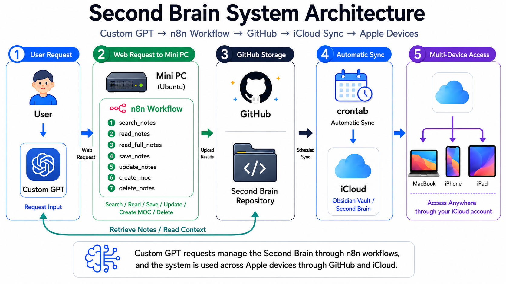

# Jarvis-Second Brain

Jarvis Second Brain Harness is an experimental open-source project for connecting ChatGPT, Codex, voice control, Mac automation, and Obsidian MCP into a personal AI operating system.

The goal of this project is not only to control a computer by voice, but to design a safe and reusable harness that allows users to connect AI assistants with their own working environment, knowledge base, and daily workflows.

This project is currently in an early stage. The initial focus is on documenting the architecture, safety model, command schema, approval flow, and automation patterns before expanding into a working implementation.

Currently I use like this<br>



## Goals

* Build a voice-driven interface for interacting with ChatGPT and Codex
* Connect Custom GPTs with local tools such as Mac automation and Obsidian MCP
* Design a safe command execution harness with explicit user approval
* Classify commands by risk level before execution
* Prevent destructive actions from running without confirmation
* Share reusable prompts, schemas, harness patterns, and security practices as open source

## Why this project matters

Many people use ChatGPT as a question-answering tool, but fewer users have a safe and reusable way to connect it with their actual working environment. This project explores how ChatGPT and Codex can become part of a personal operating system: helping users search notes, update knowledge, manage tasks, and interact with local tools through natural language and voice.

By open-sourcing this project, the project aims to provide a practical reference for developers who want to build their own AI-powered workflows, Second Brain systems, and local automation tools.

## Current status

This repository is in the planning and early implementation phase.

Current focus:

* Architecture design
* Command schema design
* Custom GPT instruction design
* Safety and approval flow
* Obsidian MCP integration planning
* Mac automation research
* Codex harness design

## Planned components

* Voice command interface
* Command parser
* Intent classification
* Risk classification
* Approval gate
* Mac automation adapter
* Obsidian MCP adapter
* n8n workflow examples
* Custom GPT instruction templates
* Codex harness examples

## Safety principles

This project follows a safe-by-default design.

* Read-only commands should be separated from write actions
* Destructive actions must require explicit approval
* External network calls must be visible to the user
* File deletion, overwrite, and data export must never run silently
* The system should explain what it plans to do before executing actions
* Logs should be available for review

## Repository structure

```text
.
├── README.md
├── ROADMAP.md
├── SECURITY.md
├── LICENSE
├── docs/
│   ├── ARCHITECTURE.md
│   ├── HARNESS_DESIGN.md
│   └── SECURITY_MODEL.md
└── examples/
    ├── command-schema.json
    ├── custom-gpt-instructions.md
    ├── n8n-workflow-overview.md
    └── safe-command-examples.md
```

## Documentation

* [Architecture](docs/ARCHITECTURE.md)
* [Harness design](docs/HARNESS_DESIGN.md)
* [Security model](docs/SECURITY_MODEL.md)
* [Roadmap](ROADMAP.md)
* [Security policy](SECURITY.md)

## Examples

* [Custom GPT instructions](examples/custom-gpt-instructions.md)
* [Command schema](examples/command-schema.json)
* [Safe command examples](examples/safe-command-examples.md)
* [n8n workflow overview](examples/n8n-workflow-overview.md)

## Project philosophy

The project treats AI automation as a tool that should be understandable, inspectable, and reversible where possible. The harness should help an assistant propose actions, explain its reasoning, and ask for approval before touching sensitive local systems.

The user remains the operator. The AI proposes and prepares actions; the harness verifies, limits, logs, and executes only what is allowed.

## License

This project is released as open source under the MIT License. See [LICENSE](LICENSE).
